Centropogon Analyses
================
Asia Kaiser
2023-06-30

\#Loading Packages

``` r
library(tidyverse)
library(lme4)
library(lmerTest)
library(emmeans)
library(ggpubr)
library(viridis)
library(bipartite)
#library(ggbipart)
library(ggmosaic)
library(ggalluvial)
library(report)
library(boot)
```

\#Reading in the Data

``` r
flow.data <- read.csv("data/Centropogon Data - Flower.csv", header = TRUE, na.strings = c(""," ","NA")) #Load in the data
str(flow.data) #Look at the structure of the data
```

    ## 'data.frame':    95 obs. of  7 variables:
    ##  $ color    : chr  "pink" "pink" "pink" "pink" ...
    ##  $ f.species: chr  "C. talamancensis" "C. talamancensis" "C. talamancensis" "C. talamancensis" ...
    ##  $ plant_id : int  1 1 1 1 1 1 2 2 2 2 ...
    ##  $ sex      : chr  "F" "M" "M" "F" ...
    ##  $ corolla  : num  43.2 45.6 43.8 45.6 45 ...
    ##  $ anther   : num  66.2 63.6 63.1 67.6 64.6 ...
    ##  $ camera   : chr  NA NA NA NA ...

``` r
cam.data <- read.csv("data/Centropogon Data - Camera.csv", header = TRUE, na.strings = c(""," ","NA"))
str(cam.data)
```

    ## 'data.frame':    58 obs. of  6 variables:
    ##  $ camera   : chr  "1" "2" "2" "4" ...
    ##  $ date     : chr  "6-30-2023" "07-02-2023" "07-01-2023" "07-01-2023" ...
    ##  $ time     : chr  "12:33" "5:30" "16:53" "8:15" ...
    ##  $ b.species: chr  "Panterpe insignis" NA "Colibri cyanotus" "Eugenes spectabilis" ...
    ##  $ f.species: chr  "C. costaricae" "C. valerii" "C. valerii" "C. talamancensis" ...
    ##  $ notes    : chr  NA "Unidentified" "Cato MFDC 1636" NA ...

``` r
bird.data <-read.csv("data/Centropogon Data - Bird.csv", header = TRUE, na.strings = c(""," ","NA"))
```

    ## Warning in read.table(file = file, header = header, sep = sep, quote = quote, :
    ## incomplete final line found by readTableHeader on 'data/Centropogon Data -
    ## Bird.csv'

``` r
str(bird.data)
```

    ## 'data.frame':    3 obs. of  13 variables:
    ##  $ b.species  : chr  "Panterpe insignis" "Colibri cyanotus" "Eugenes spectabilis"
    ##  $ fem_length : num  19.5 22.6 36.3
    ##  $ male_length: num  19.3 23.6 31
    ##  $ avg_length : num  19.4 23.1 33.6
    ##  $ low_length : num  17.8 20.2 29
    ##  $ high_length: num  21.8 25.5 37.5
    ##  $ min_corolla: num  25.6 24.2 42
    ##  $ max_corolla: num  31.1 29.8 52.6
    ##  $ avg_corolla: num  28.7 27.9 46
    ##  $ min_anther : num  33.1 36.5 54.7
    ##  $ max_anther : num  41.2 48.9 75.2
    ##  $ avg_anther : num  37.7 44.5 66
    ##  $ reference  : chr  "https://birdsoftheworld.org/bow/species/fithum1/cur/appendices" "https://birdsoftheworld.org/bow/species/lesvio1/cur/appearance#meas" "https://birdsoftheworld.org/bow/species/maghum2/cur/appearance#meas"

``` r
#changing plant id to factor
flow.data$f.plant_id <- as.factor(flow.data$plant_id)

#museum specimen measurement data
museum.data <-read.csv("data/Centropogon-hummer_data.csv")
```

\#Exploring the Flower Data

``` r
species <- unique(flow.data$f.species)

#Histograms of Corolla length by species
for (i in species) {
  x <- flow.data$corolla[flow.data$f.species== i]
  hist(x,
       xlab = paste("Corolla Length",i))
}
```

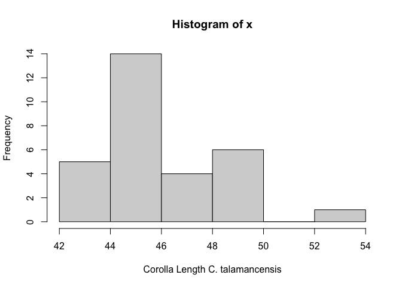<!-- -->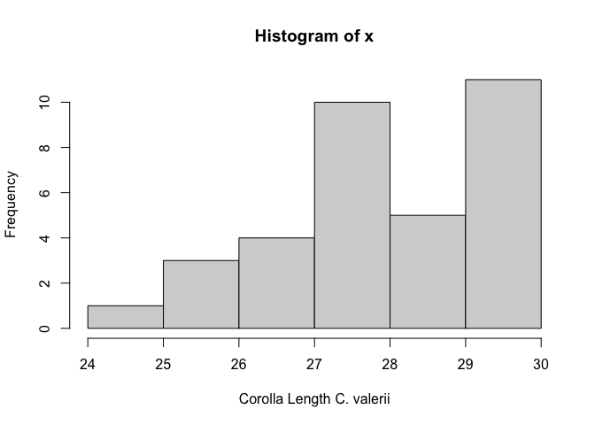<!-- -->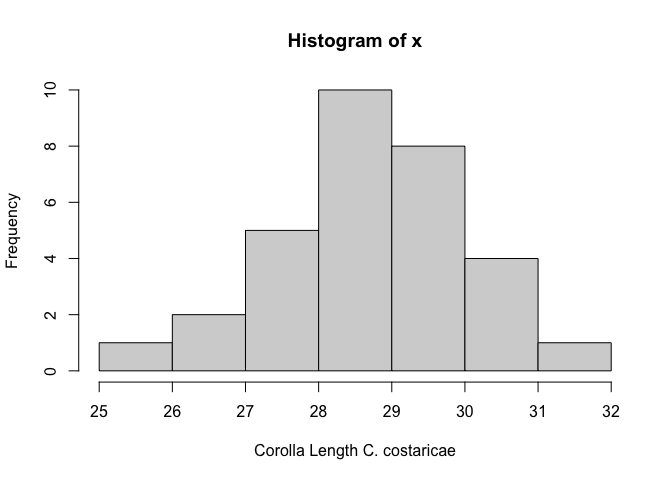<!-- -->

``` r
#Histograms of Anther length by species
for (i in species) {
  x <- flow.data$anther[flow.data$f.species== i]
  hist(x,
       xlab = paste("Anther Length",i))
}
```

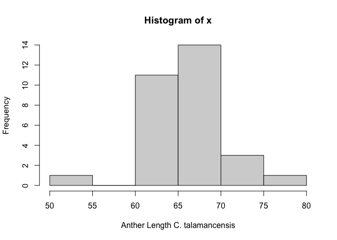<!-- -->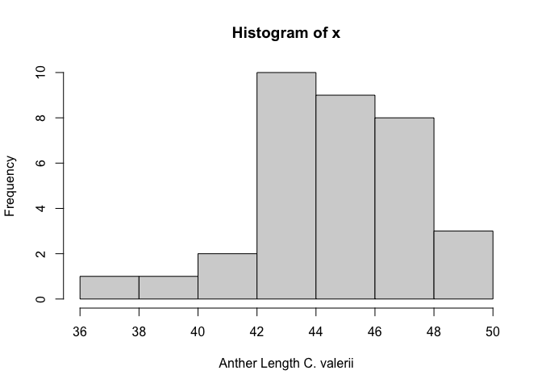<!-- -->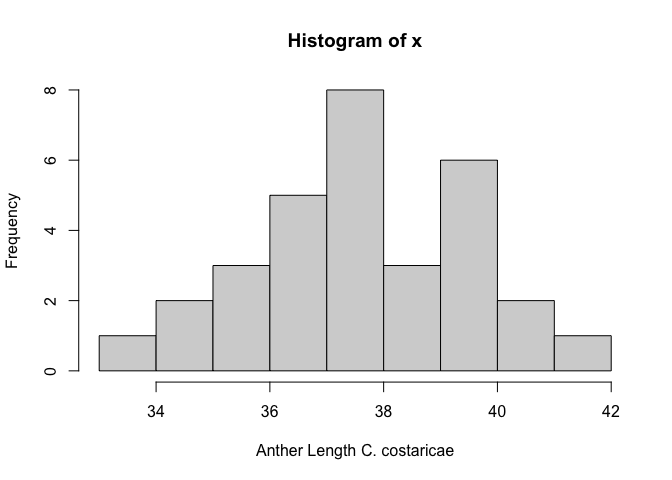<!-- -->

## Shapiro Wilk Tests of normality for Flower Data

``` r
#Shapiro-Wilk Test of normality of Corolla length by species
for (i in species) {
  x <- flow.data$corolla[flow.data$f.species== i]
  print(shapiro.test(x))
}
```

    ## 
    ##  Shapiro-Wilk normality test
    ## 
    ## data:  x
    ## W = 0.94262, p-value = 0.107
    ## 
    ## 
    ##  Shapiro-Wilk normality test
    ## 
    ## data:  x
    ## W = 0.93599, p-value = 0.04687
    ## 
    ## 
    ##  Shapiro-Wilk normality test
    ## 
    ## data:  x
    ## W = 0.98252, p-value = 0.8784

``` r
#Shapiro-Wilk Test of normality of Anther length by species
for (i in species) {
  x <- flow.data$anther[flow.data$f.species== i]
  print(shapiro.test(x))
}
```

    ## 
    ##  Shapiro-Wilk normality test
    ## 
    ## data:  x
    ## W = 0.94096, p-value = 0.09651
    ## 
    ## 
    ##  Shapiro-Wilk normality test
    ## 
    ## data:  x
    ## W = 0.94588, p-value = 0.09241
    ## 
    ## 
    ##  Shapiro-Wilk normality test
    ## 
    ## data:  x
    ## W = 0.97751, p-value = 0.7403

``` r
## All look approximately normally distributed. 
```

## Analyzing Flower Data

*Are there differences in corolla length by species and sex?*

``` r
#Re-ording flowers
flow.data$f.species <- factor(flow.data$f.species, levels=c('C. talamancensis', 'C. valerii', 'C. costaricae'))

#Calculating exsertion length
flow.data$exsertion <- flow.data$anther-flow.data$corolla

mod.1 <-lme4::lmer(corolla ~ f.species + (1|f.plant_id), data = flow.data)
summary(mod.1)
```

    ## Linear mixed model fit by REML ['lmerMod']
    ## Formula: corolla ~ f.species + (1 | f.plant_id)
    ##    Data: flow.data
    ## 
    ## REML criterion at convergence: 361.7
    ## 
    ## Scaled residuals: 
    ##     Min      1Q  Median      3Q     Max 
    ## -2.7515 -0.5521  0.0413  0.5235  3.7635 
    ## 
    ## Random effects:
    ##  Groups     Name        Variance Std.Dev.
    ##  f.plant_id (Intercept) 0.7943   0.8912  
    ##  Residual               2.2753   1.5084  
    ## Number of obs: 95, groups:  f.plant_id, 21
    ## 
    ## Fixed effects:
    ##                        Estimate Std. Error t value
    ## (Intercept)             45.9730     0.4845   94.90
    ## f.speciesC. valerii    -18.1489     0.6595  -27.52
    ## f.speciesC. costaricae -17.6803     0.6661  -26.54
    ## 
    ## Correlation of Fixed Effects:
    ##             (Intr) f.sC.v
    ## f.spcsC.vlr -0.735       
    ## f.spcsC.cst -0.727  0.534

``` r
emmeans(mod.1, list(pairwise ~ f.species), adjust = "tukey")
```

    ## $`emmeans of f.species`
    ##  f.species        emmean    SE   df lower.CL upper.CL
    ##  C. talamancensis   46.0 0.484 12.0     44.9     47.0
    ##  C. valerii         27.8 0.448 12.6     26.9     28.8
    ##  C. costaricae      28.3 0.470 22.3     27.3     29.3
    ## 
    ## Degrees-of-freedom method: kenward-roger 
    ## Confidence level used: 0.95 
    ## 
    ## $`pairwise differences of f.species`
    ##  1                                estimate    SE   df t.ratio p.value
    ##  C. talamancensis - C. valerii      18.149 0.660 12.3  27.514  <.0001
    ##  C. talamancensis - C. costaricae   17.680 0.675 15.8  26.201  <.0001
    ##  C. valerii - C. costaricae         -0.469 0.649 16.6  -0.722  0.7540
    ## 
    ## Degrees-of-freedom method: kenward-roger 
    ## P value adjustment: tukey method for comparing a family of 3 estimates

``` r
report(mod.1)
```

    ## We fitted a linear mixed model (estimated using REML and nloptwrap optimizer)
    ## to predict corolla with f.species (formula: corolla ~ f.species). The model
    ## included f.plant_id as random effect (formula: ~1 | f.plant_id). The model's
    ## total explanatory power is substantial (conditional R2 = 0.97) and the part
    ## related to the fixed effects alone (marginal R2) is of 0.96. The model's
    ## intercept, corresponding to f.species = C. talamancensis, is at 45.97 (95% CI
    ## [45.01, 46.94], t(90) = 94.90, p < .001). Within this model:
    ## 
    ##   - The effect of f species [C. valerii] is statistically significant and
    ## negative (beta = -18.15, 95% CI [-19.46, -16.84], t(90) = -27.52, p < .001;
    ## Std. beta = -2.15, 95% CI [-2.30, -1.99])
    ##   - The effect of f species [C. costaricae] is statistically significant and
    ## negative (beta = -17.68, 95% CI [-19.00, -16.36], t(90) = -26.54, p < .001;
    ## Std. beta = -2.09, 95% CI [-2.25, -1.93])
    ## 
    ## Standardized parameters were obtained by fitting the model on a standardized
    ## version of the dataset. 95% Confidence Intervals (CIs) and p-values were
    ## computed using a Wald t-distribution approximation.

*Are there differences in anther length by species and sex?*

``` r
mod.2 <-lmer(anther ~ f.species + (1|f.plant_id), data = flow.data)
summary(mod.2)
```

    ## Linear mixed model fit by REML. t-tests use Satterthwaite's method [
    ## lmerModLmerTest]
    ## Formula: anther ~ f.species + (1 | f.plant_id)
    ##    Data: flow.data
    ## 
    ## REML criterion at convergence: 454.8
    ## 
    ## Scaled residuals: 
    ##     Min      1Q  Median      3Q     Max 
    ## -4.4630 -0.4778  0.0338  0.5860  3.4551 
    ## 
    ## Random effects:
    ##  Groups     Name        Variance Std.Dev.
    ##  f.plant_id (Intercept) 1.841    1.357   
    ##  Residual               6.372    2.524   
    ## Number of obs: 95, groups:  f.plant_id, 21
    ## 
    ## Fixed effects:
    ##                        Estimate Std. Error      df t value Pr(>|t|)    
    ## (Intercept)              65.959      0.762  12.209   86.56  < 2e-16 ***
    ## f.speciesC. valerii     -21.503      1.038  12.469  -20.72 4.92e-11 ***
    ## f.speciesC. costaricae  -28.323      1.056  15.851  -26.83 1.23e-14 ***
    ## ---
    ## Signif. codes:  0 '***' 0.001 '**' 0.01 '*' 0.05 '.' 0.1 ' ' 1
    ## 
    ## Correlation of Fixed Effects:
    ##             (Intr) f.sC.v
    ## f.spcsC.vlr -0.734       
    ## f.spcsC.cst -0.722  0.530

``` r
emmeans(mod.2, list(pairwise ~ f.species), adjust = "tukey")
```

    ## $`emmeans of f.species`
    ##  f.species        emmean    SE   df lower.CL upper.CL
    ##  C. talamancensis   66.0 0.762 11.9     64.3     67.6
    ##  C. valerii         44.5 0.705 12.4     42.9     46.0
    ##  C. costaricae      37.6 0.754 21.3     36.1     39.2
    ## 
    ## Degrees-of-freedom method: kenward-roger 
    ## Confidence level used: 0.95 
    ## 
    ## $`pairwise differences of f.species`
    ##  1                                estimate   SE   df t.ratio p.value
    ##  C. talamancensis - C. valerii       21.50 1.04 12.2  20.712  <.0001
    ##  C. talamancensis - C. costaricae    28.32 1.07 15.5  26.416  <.0001
    ##  C. valerii - C. costaricae           6.82 1.03 16.2   6.605  <.0001
    ## 
    ## Degrees-of-freedom method: kenward-roger 
    ## P value adjustment: tukey method for comparing a family of 3 estimates

``` r
report(mod.2)
```

    ## We fitted a linear mixed model (estimated using REML and nloptwrap optimizer)
    ## to predict anther with f.species (formula: anther ~ f.species). The model
    ## included f.plant_id as random effect (formula: ~1 | f.plant_id). The model's
    ## total explanatory power is substantial (conditional R2 = 0.96) and the part
    ## related to the fixed effects alone (marginal R2) is of 0.95. The model's
    ## intercept, corresponding to f.species = C. talamancensis, is at 65.96 (95% CI
    ## [64.44, 67.47], t(90) = 86.56, p < .001). Within this model:
    ## 
    ##   - The effect of f species [C. valerii] is statistically significant and
    ## negative (beta = -21.50, 95% CI [-23.57, -19.44], t(90) = -20.72, p < .001;
    ## Std. beta = -1.76, 95% CI [-1.93, -1.59])
    ##   - The effect of f species [C. costaricae] is statistically significant and
    ## negative (beta = -28.32, 95% CI [-30.42, -26.23], t(90) = -26.83, p < .001;
    ## Std. beta = -2.32, 95% CI [-2.49, -2.15])
    ## 
    ## Standardized parameters were obtained by fitting the model on a standardized
    ## version of the dataset. 95% Confidence Intervals (CIs) and p-values were
    ## computed using a Wald t-distribution approximation.

*Are there differences in anther length by species and sex?*

``` r
mod.3 <-lmer(exsertion ~ f.species + (1|f.plant_id), data = flow.data)
summary(mod.3)
```

    ## Linear mixed model fit by REML. t-tests use Satterthwaite's method [
    ## lmerModLmerTest]
    ## Formula: exsertion ~ f.species + (1 | f.plant_id)
    ##    Data: flow.data
    ## 
    ## REML criterion at convergence: 456.2
    ## 
    ## Scaled residuals: 
    ##     Min      1Q  Median      3Q     Max 
    ## -3.6630 -0.4115  0.1488  0.5401  2.7307 
    ## 
    ## Random effects:
    ##  Groups     Name        Variance Std.Dev.
    ##  f.plant_id (Intercept) 0.5785   0.7606  
    ##  Residual               7.0504   2.6553  
    ## Number of obs: 95, groups:  f.plant_id, 21
    ## 
    ## Fixed effects:
    ##                        Estimate Std. Error       df t value Pr(>|t|)    
    ## (Intercept)             19.9857     0.5922  14.6339  33.747 2.73e-15 ***
    ## f.speciesC. valerii     -3.3377     0.8098  15.0775  -4.122 0.000896 ***
    ## f.speciesC. costaricae -10.8330     0.8423  15.3374 -12.862 1.27e-09 ***
    ## ---
    ## Signif. codes:  0 '***' 0.001 '**' 0.01 '*' 0.05 '.' 0.1 ' ' 1
    ## 
    ## Correlation of Fixed Effects:
    ##             (Intr) f.sC.v
    ## f.spcsC.vlr -0.731       
    ## f.spcsC.cst -0.703  0.514

``` r
emmeans(mod.3, list(pairwise ~ f.species), adjust = "tukey")
```

    ## $`emmeans of f.species`
    ##  f.species        emmean    SE   df lower.CL upper.CL
    ##  C. talamancensis  19.99 0.592 11.7    18.69     21.3
    ##  C. valerii        16.65 0.553 12.5    15.45     17.8
    ##  C. costaricae      9.15 0.639 12.8     7.77     10.5
    ## 
    ## Degrees-of-freedom method: kenward-roger 
    ## Confidence level used: 0.95 
    ## 
    ## $`pairwise differences of f.species`
    ##  1                                estimate    SE   df t.ratio p.value
    ##  C. talamancensis - C. valerii        3.34 0.810 12.0   4.119  0.0037
    ##  C. talamancensis - C. costaricae    10.83 0.871 12.2  12.431  <.0001
    ##  C. valerii - C. costaricae           7.50 0.845 12.7   8.866  <.0001
    ## 
    ## Degrees-of-freedom method: kenward-roger 
    ## P value adjustment: tukey method for comparing a family of 3 estimates

``` r
report(mod.3)
```

    ## We fitted a linear mixed model (estimated using REML and nloptwrap optimizer)
    ## to predict exsertion with f.species (formula: exsertion ~ f.species). The model
    ## included f.plant_id as random effect (formula: ~1 | f.plant_id). The model's
    ## total explanatory power is substantial (conditional R2 = 0.75) and the part
    ## related to the fixed effects alone (marginal R2) is of 0.73. The model's
    ## intercept, corresponding to f.species = C. talamancensis, is at 19.99 (95% CI
    ## [18.81, 21.16], t(90) = 33.75, p < .001). Within this model:
    ## 
    ##   - The effect of f species [C. valerii] is statistically significant and
    ## negative (beta = -3.34, 95% CI [-4.95, -1.73], t(90) = -4.12, p < .001; Std.
    ## beta = -0.63, 95% CI [-0.93, -0.33])
    ##   - The effect of f species [C. costaricae] is statistically significant and
    ## negative (beta = -10.83, 95% CI [-12.51, -9.16], t(90) = -12.86, p < .001; Std.
    ## beta = -2.04, 95% CI [-2.35, -1.72])
    ## 
    ## Standardized parameters were obtained by fitting the model on a standardized
    ## version of the dataset. 95% Confidence Intervals (CIs) and p-values were
    ## computed using a Wald t-distribution approximation.

## Aggregating Flower Corolla and Anther Length

``` r
flow.data.agg.1 <- aggregate(anther ~ f.species, data = flow.data, FUN = mean)

flow.data.agg <- flow.data %>%
  group_by(f.species) %>%
  summarise(corolla=mean(corolla))%>%
  left_join(flow.data.agg.1, by = c("f.species"))

#Looking at mean anther and corolla length for each plant species
#Calculating exsertion length
flow.data.agg$exsertion <- flow.data.agg$anther-flow.data.agg$corolla
flow.data.agg
```

    ## # A tibble: 3 × 4
    ##   f.species        corolla anther exsertion
    ##   <fct>              <dbl>  <dbl>     <dbl>
    ## 1 C. talamancensis    46.0   66.0     20.0 
    ## 2 C. valerii          27.9   44.5     16.7 
    ## 3 C. costaricae       28.7   37.7      8.98

``` r
#Looking at how many measurements were taken for each plant species
flow.obs <- flow.data %>%
  group_by(f.species) %>%
  summarise(n.obs = n())

flow.data.agg <- flow.data.agg %>%
  left_join(flow.obs, by = c("f.species"))
```

\#Data Visualization \##Creating Theme for Plots

``` r
AsiaTheme <- theme(axis.text.x = element_text(size = 15, face = "italic"),
  axis.text.y = element_text(size = 19),
  axis.title.x = element_text(size = 16),
  axis.title.y = element_text(size = 16),
   legend.title = element_text(size = 15),
    legend.text = element_text(size = 14))
```

\##Plots

``` r
plot(corolla ~ anther, data = flow.data)
```

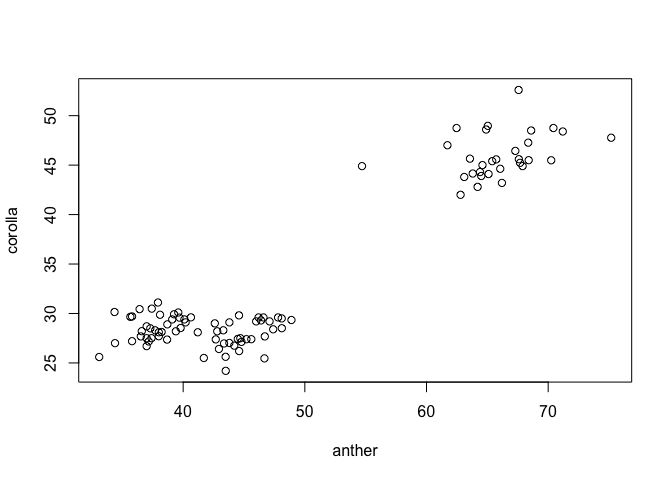<!-- -->

``` r
palette <- viridis::turbo(n = 8)

plot.1a <- ggplot(flow.data, aes(y = corolla, x= f.species, color = sex))+
  geom_boxplot(lwd=1)+
  geom_jitter(alpha=0.6, width=0.15)+
  ylim(25,60)+
    theme_classic2()+
  AsiaTheme+
    labs(x = "",
       y = "Corolla length (mm)")+
  scale_color_manual(values = palette)

plot.1b <- ggplot(flow.data, aes(y = anther, x= f.species, color = sex))+
  geom_boxplot(lwd=1)+
  geom_jitter(alpha=0.6, width=0.15)+
  ylim(30,80)+
  theme_classic()+
  AsiaTheme+
      labs(x = "",
       y = "Anther length (mm)")+
    scale_color_manual(values = palette)

plot.1 <-ggarrange(plot.1a,plot.1b)
```

    ## Warning: Removed 1 row containing non-finite outside the scale range
    ## (`stat_boxplot()`).

    ## Warning: Removed 1 row containing missing values or values outside the scale range
    ## (`geom_point()`).

``` r
plot.1
```

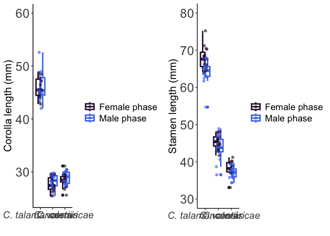<!-- -->

``` r
ggsave("figures/plot1.png", plot.1, width = 13, height = 5, units = "in")
```

# Network Analyses

### Getting Datasheet into proper matrix format

``` r
#A dataframe with bird abundance by plant species
cam.data.1 <- cam.data %>%
  filter(cam.data$b.species != "unknown" & !is.na(cam.data$b.species)) %>%
   group_by(f.species, b.species) %>%
  summarise(n.obs=n())
```

    ## `summarise()` has grouped output by 'f.species'. You can override using the
    ## `.groups` argument.

``` r
#Pivot dataframe wide to get into correct format
cam.data.wide <- as.data.frame(pivot_wider(cam.data.1, names_from = f.species, values_from = n.obs, values_fill = 0))
```

### Analysing Frequencies of visits per flower

#### Chi-square test

``` r
cam.data.wide <-cam.data.wide[,-1]
chisq <- chisq.test(cam.data.wide)
```

    ## Warning in chisq.test(cam.data.wide): Chi-squared approximation may be
    ## incorrect

``` r
chisq
```

    ## 
    ##  Pearson's Chi-squared test
    ## 
    ## data:  cam.data.wide
    ## X-squared = 97.164, df = 4, p-value < 2.2e-16

\##Visualizing Results of Chi Square Test

``` r
cam.data.1$f.species <- factor(cam.data.1$f.species, levels=c('C. talamancensis', 'C. valerii', 'C. costaricae'))
species
```

    ## [1] "C. talamancensis" "C. valerii"       "C. costaricae"

``` r
plot.2 <- ggplot(cam.data.1, aes(x = f.species, y = n.obs))+
  geom_col(aes(fill = b.species), width = 0.7)+
    theme_classic2()+
  AsiaTheme+
    labs(x = "Centropogon Species",
       y = "Pollinator Visits",
       color=NULL)+
   theme(legend.position="top",
        legend.title=element_blank(),
        legend.text = element_text(size = 14, face = "italic"))+
     scale_fill_manual(values = palette)

plot.2
```

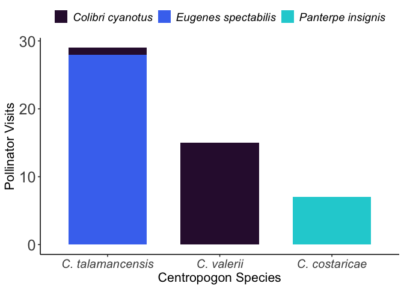<!-- -->

``` r
ggsave("figures/Figure 3.png", plot.2, width = 7, height = 5, units = "in")
```

## Adding Bird measurements to FLow.Data

### Adding Total Culmen Length

``` r
#Adding birds to dataset
flow.data$b.species[flow.data$f.species == "C. talamancensis"] <-"Eugenes spectabilis"
flow.data$b.species[flow.data$f.species == "C. valerii"] <-"Colibri cyanotus"
flow.data$b.species[flow.data$f.species == "C. costaricae"] <- "Panterpe insignis"

#Removing male Eugenes spectabilis specimens from museum dataset
museum.data <-museum.data[!(museum.data$Species == "Eugenes spectabilis" & (museum.data$Sex == "M"|museum.data$Sex == "M inm (?)")),]


#Adding Total culmen length to dataset by sampling from museum specimen measurements
set.seed(1000)
eug_spe_length<- nrow(filter(flow.data,b.species == "Eugenes spectabilis"))
eug_spe <-sample(museum.data$Total_culmen[museum.data$Species== "Eugenes spectabilis"],eug_spe_length,replace = TRUE)

col_cya_length<- nrow(filter(flow.data,b.species == "Colibri cyanotus"))
col_cya <-sample(museum.data$Total_culmen[museum.data$Species== "Colibri cyanotus"],col_cya_length,replace = TRUE)

pan_ins_length <- nrow(filter(flow.data,b.species == "Panterpe insignis"))
pan_ins <-sample(museum.data$Total_culmen[museum.data$Species== "Panterpe insignis"],pan_ins_length,replace = TRUE)

flow.data$tot.culmen.length[flow.data$b.species == "Eugenes spectabilis"] <-eug_spe
flow.data$tot.culmen.length[flow.data$b.species == "Colibri cyanotus"] <-col_cya
flow.data$tot.culmen.length[flow.data$b.species == "Panterpe insignis"] <-pan_ins

#Adding Exposed culmen length to dataset by sampling from museum specimen measurements
eug_spe_length<- nrow(filter(flow.data,b.species == "Eugenes spectabilis"))
eug_spe <-sample(museum.data$Exposed_culmen_mm[museum.data$Species== "Eugenes spectabilis"],eug_spe_length,replace = TRUE)

col_cya_length<- nrow(filter(flow.data,b.species == "Colibri cyanotus"))
col_cya <-sample(museum.data$Exposed_culmen_mm[museum.data$Species== "Colibri cyanotus"],col_cya_length,replace = TRUE)

pan_ins_length <- nrow(filter(flow.data,b.species == "Panterpe insignis"))
pan_ins <-sample(museum.data$Exposed_culmen_mm[museum.data$Species== "Panterpe insignis"],pan_ins_length,replace = TRUE)

flow.data$exp.culmen.length[flow.data$b.species == "Eugenes spectabilis"] <-eug_spe
flow.data$exp.culmen.length[flow.data$b.species == "Colibri cyanotus"] <-col_cya
flow.data$exp.culmen.length[flow.data$b.species == "Panterpe insignis"] <-pan_ins
```

# Looking at Correlation Bird Measurements and flower size

## Bootstrapping to determine correlation values and confidence intervals- Exposed Culmen Length to Anther Length (mm)

``` r
x <-flow.data$anther
y <-flow.data$exp.culmen.length

data <- data.frame(x,y)

Boot_ExpCulmen_Anther <- boot(data, 
  statistic = function(data, i) {
    cor(data[i, "x"], data[i, "y"], method='pearson')
  },
  R = 1000
)
Boot_ExpCulmen_Anther
```

    ## 
    ## ORDINARY NONPARAMETRIC BOOTSTRAP
    ## 
    ## 
    ## Call:
    ## boot(data = data, statistic = function(data, i) {
    ##     cor(data[i, "x"], data[i, "y"], method = "pearson")
    ## }, R = 1000)
    ## 
    ## 
    ## Bootstrap Statistics :
    ##      original      bias    std. error
    ## t1* 0.8776239 0.002577153   0.0217337

``` r
ExpCulmen_Anther_boot.ci <- boot.ci(Boot_ExpCulmen_Anther, type = c("norm", "basic", "perc", "bca"))
ExpCulmen_Anther_boot.ci
```

    ## BOOTSTRAP CONFIDENCE INTERVAL CALCULATIONS
    ## Based on 1000 bootstrap replicates
    ## 
    ## CALL : 
    ## boot.ci(boot.out = Boot_ExpCulmen_Anther, type = c("norm", "basic", 
    ##     "perc", "bca"))
    ## 
    ## Intervals : 
    ## Level      Normal              Basic         
    ## 95%   ( 0.8324,  0.9176 )   ( 0.8334,  0.9167 )  
    ## 
    ## Level     Percentile            BCa          
    ## 95%   ( 0.8386,  0.9219 )   ( 0.8256,  0.9153 )  
    ## Calculations and Intervals on Original Scale
    ## Some BCa intervals may be unstable

``` r
plot(density(Boot_ExpCulmen_Anther$t))
abline(v = 0, lty = "dashed", col = "grey60")
```

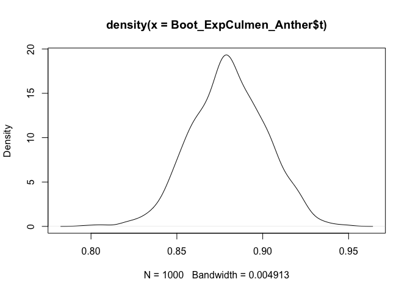<!-- -->

## Bootstrapping to determine correlation values and confidence intervals- Total Culmen Length to Anther Length (mm)

``` r
x <-flow.data$anther
y <-flow.data$tot.culmen.length

data <- data.frame(x,y)

Boot_TotCulmen_Anther <- boot(data, 
  statistic = function(data, i) {
    cor(data[i, "x"], data[i, "y"], method='pearson')
  },
  R = 1000
)
Boot_TotCulmen_Anther
```

    ## 
    ## ORDINARY NONPARAMETRIC BOOTSTRAP
    ## 
    ## 
    ## Call:
    ## boot(data = data, statistic = function(data, i) {
    ##     cor(data[i, "x"], data[i, "y"], method = "pearson")
    ## }, R = 1000)
    ## 
    ## 
    ## Bootstrap Statistics :
    ##      original       bias    std. error
    ## t1* 0.9250858 0.0005366443  0.01266046

``` r
?boot.ci

TotCulmen_Anther_boot.ci <- boot.ci(Boot_TotCulmen_Anther, type = c("norm", "basic", "perc", "bca"))
TotCulmen_Anther_boot.ci
```

    ## BOOTSTRAP CONFIDENCE INTERVAL CALCULATIONS
    ## Based on 1000 bootstrap replicates
    ## 
    ## CALL : 
    ## boot.ci(boot.out = Boot_TotCulmen_Anther, type = c("norm", "basic", 
    ##     "perc", "bca"))
    ## 
    ## Intervals : 
    ## Level      Normal              Basic         
    ## 95%   ( 0.8997,  0.9494 )   ( 0.9009,  0.9523 )  
    ## 
    ## Level     Percentile            BCa          
    ## 95%   ( 0.8978,  0.9492 )   ( 0.8899,  0.9447 )  
    ## Calculations and Intervals on Original Scale
    ## Some BCa intervals may be unstable

``` r
plot(density(Boot_TotCulmen_Anther$t))
abline(v = 0, lty = "dashed", col = "grey60")
```

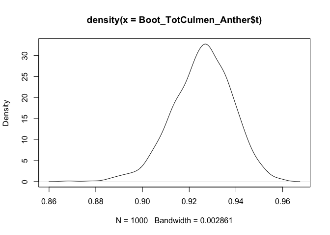<!-- -->

## Bootstrapping to determine correlation values and confidence intervals- Total Culmen Length to Corolla Length (mm)

``` r
x <-flow.data$corolla
y <-flow.data$tot.culmen.length

data <- data.frame(x,y)

Boot_TotCulmen_Corolla <- boot(data, 
  statistic = function(data, i) {
    cor(data[i, "x"], data[i, "y"], method='pearson')
  },
  R = 1000
)
Boot_TotCulmen_Corolla
```

    ## 
    ## ORDINARY NONPARAMETRIC BOOTSTRAP
    ## 
    ## 
    ## Call:
    ## boot(data = data, statistic = function(data, i) {
    ##     cor(data[i, "x"], data[i, "y"], method = "pearson")
    ## }, R = 1000)
    ## 
    ## 
    ## Bootstrap Statistics :
    ##      original        bias    std. error
    ## t1* 0.9283094 -6.949401e-05  0.01060912

``` r
?boot.ci

TotCulmen_Corolla_boot.ci <- boot.ci(Boot_TotCulmen_Corolla, type = c("norm", "basic", "perc", "bca"))
TotCulmen_Corolla_boot.ci
```

    ## BOOTSTRAP CONFIDENCE INTERVAL CALCULATIONS
    ## Based on 1000 bootstrap replicates
    ## 
    ## CALL : 
    ## boot.ci(boot.out = Boot_TotCulmen_Corolla, type = c("norm", "basic", 
    ##     "perc", "bca"))
    ## 
    ## Intervals : 
    ## Level      Normal              Basic         
    ## 95%   ( 0.9076,  0.9492 )   ( 0.9097,  0.9502 )  
    ## 
    ## Level     Percentile            BCa          
    ## 95%   ( 0.9064,  0.9469 )   ( 0.9045,  0.9462 )  
    ## Calculations and Intervals on Original Scale

``` r
plot(density(Boot_TotCulmen_Corolla$t))
abline(v = 0, lty = "dashed", col = "grey60")
```

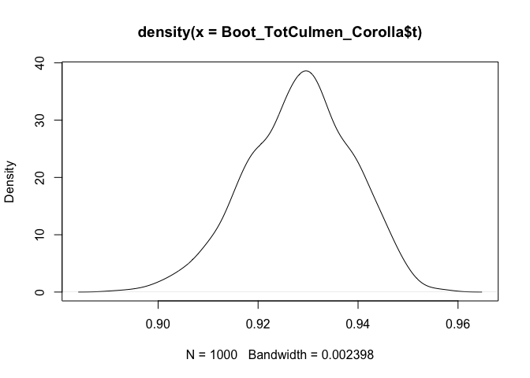<!-- -->

## *Correlation Plots*

``` r
#Anther length and Exposed Culmen Length
plot.4 <-ggplot(flow.data, aes(x = exp.culmen.length, y = anther, color = b.species))+
  geom_point()+
   theme_classic2()+
  AsiaTheme+
    labs(x = "Hummingbird exposed culmen length (mm)",
       y = "Anther length (mm)",
       color=NULL)+
   theme(legend.position="top",
        legend.title=element_blank(),
        legend.text = element_text(size = 14, face = "italic"),
        legend.box.spacing = unit(25, "pt"))+
      scale_color_manual(values = palette,breaks=c("Panterpe insignis", "Colibri cyanotus", "Eugenes spectabilis"))
plot.4
```

<!-- -->

``` r
#Anther length and Total Culmen Length
plot.5 <-ggplot(flow.data, aes(x = tot.culmen.length, y = anther, color = b.species))+
  geom_point()+
   theme_classic2()+
  AsiaTheme+
    labs(x = "Hummingbird total culmen length (mm)",
       y = "Anther length (mm)",
       color=NULL)+
   theme(legend.position="top",
        legend.title=element_blank(),
        legend.text = element_text(size = 14, face = "italic"),
        legend.box.spacing = unit(25, "pt"))+
    scale_color_manual(values = palette,breaks=c("Panterpe insignis", "Colibri cyanotus", "Eugenes spectabilis"))
    
plot.5
```

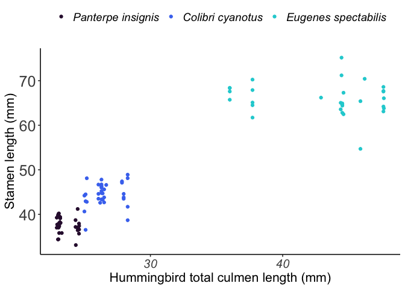<!-- -->

``` r
ggsave("figures/Anther length cor plot.png", plot.5, width = 7, height = 5, units = "in")
```

``` r
#Corolla length and Exposed Culmen Length
plot.6 <-ggplot(flow.data, aes(x = exp.culmen.length, y = corolla, color = b.species))+
  geom_point()+
   theme_classic2()+
  AsiaTheme+
    labs(x = "Hummingbird exposed culmen length (mm)",
       y = "Corolla length (mm)",
       color=NULL)+
   theme(legend.position="top",
        legend.title=element_blank(),
        legend.text = element_text(size = 14, face = "italic"),
        legend.box.spacing = unit(25, "pt"))+
      scale_color_manual(values = palette,breaks=c("Panterpe insignis", "Colibri cyanotus", "Eugenes spectabilis"))
plot.6
```

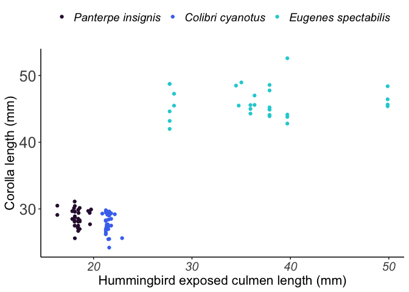<!-- -->

``` r
#Corolla length and Total Culmen Length
plot.7 <-ggplot(flow.data, aes(x = tot.culmen.length, y = corolla, color = b.species))+
  geom_point()+
   theme_classic2()+
  AsiaTheme+
    labs(x = "Hummingbird total culmen length (mm)",
       y = "Corolla length (mm)",
       color=NULL)+
   theme(legend.position="top",
        legend.title=element_blank(),
        legend.text = element_text(size = 14, face = "italic"),
        legend.box.spacing = unit(25, "pt"))+
      scale_color_manual(values = palette,breaks=c("Panterpe insignis", "Colibri cyanotus", "Eugenes spectabilis"))
plot.7
```

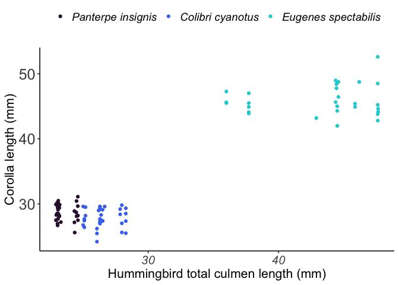<!-- -->

``` r
ggsave("figures/Corolla length cor plot.png", plot.7, width = 7, height = 5, units = "in")
```

## *Correlation Estimate Density Plots*

Bootstrap R values for corolla length and exposed and total culmen
length

``` r
mat <- matrix(ncol = 0, nrow = 1000) 
# converting the matrix to data frame 
Boot.ci.df <- data.frame(mat) 
Boot.ci.df$TotCulmenCI_corolla <-Boot_TotCulmen_Corolla$t
Boot.ci.df$TotCulmenCI_anther <-Boot_TotCulmen_Anther$t

#Total Culmen Length and Corrolla Correlation
corolla.ci.plot <- ggplot(Boot.ci.df, aes(x=TotCulmenCI_corolla))+
  geom_density(color="#38787D")+
  geom_vline(aes(xintercept=0.9283094),
            color="#3D4480", linetype="dashed", size=1)+
     theme_classic2()+
  AsiaTheme+
   labs(x = "Bootstrapped R values for total culmen and corolla length")
```

    ## Warning: Using `size` aesthetic for lines was deprecated in ggplot2 3.4.0.
    ## ℹ Please use `linewidth` instead.
    ## This warning is displayed once every 8 hours.
    ## Call `lifecycle::last_lifecycle_warnings()` to see where this warning was
    ## generated.

``` r
corolla.ci.plot
```

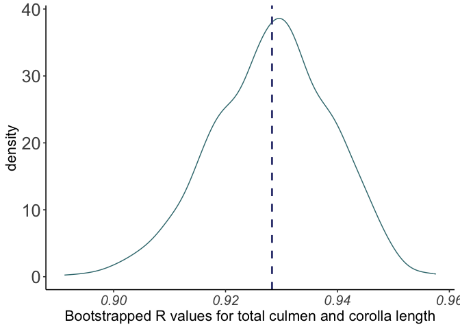<!-- -->

``` r
#Total Culmen Length and Anther Correlation
anther.ci.plot <- ggplot(Boot.ci.df, aes(x=TotCulmenCI_anther))+
  geom_density(color="#38787D")+
  geom_vline(aes(xintercept=0.9250858),
            color="#3D4480", linetype="dashed", size=1)+
     theme_classic2()+
  AsiaTheme+
   labs(x = "Bootstrapped R values for total culmen and anther length")
anther.ci.plot
```

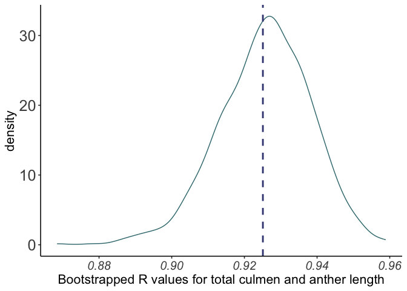<!-- -->

``` r
ggsave("figures/Corrolla length ci plot.png", corolla.ci.plot, width = 7, height = 5, units = "in")
ggsave("figures/Anther length ci plot.png", anther.ci.plot, width = 7, height = 5, units = "in")
```

# Citations

R

``` r
#R
citation()
```

    ## To cite R in publications use:
    ## 
    ##   R Core Team (2025). _R: A Language and Environment for Statistical
    ##   Computing_. R Foundation for Statistical Computing, Vienna, Austria.
    ##   <https://www.R-project.org/>.
    ## 
    ## A BibTeX entry for LaTeX users is
    ## 
    ##   @Manual{,
    ##     title = {R: A Language and Environment for Statistical Computing},
    ##     author = {{R Core Team}},
    ##     organization = {R Foundation for Statistical Computing},
    ##     address = {Vienna, Austria},
    ##     year = {2025},
    ##     url = {https://www.R-project.org/},
    ##   }
    ## 
    ## We have invested a lot of time and effort in creating R, please cite it
    ## when using it for data analysis. See also 'citation("pkgname")' for
    ## citing R packages.

``` r
#R version 
version$version.string
```

    ## [1] "R version 4.4.3 (2025-02-28)"

# Packages versions

``` r
library(purrr)

c("tidyverse", "lme4", "lmerTest","emmeans","ggpubr","viridis","bipartite","ggmosaic","report","boot") %>%
  map(citation) %>%
  print(style = "text")
```

    ## [[1]]
    ## Wickham H, Averick M, Bryan J, Chang W, McGowan LD, François R,
    ## Grolemund G, Hayes A, Henry L, Hester J, Kuhn M, Pedersen TL, Miller E,
    ## Bache SM, Müller K, Ooms J, Robinson D, Seidel DP, Spinu V, Takahashi
    ## K, Vaughan D, Wilke C, Woo K, Yutani H (2019). "Welcome to the
    ## tidyverse." _Journal of Open Source Software_, *4*(43), 1686.
    ## doi:10.21105/joss.01686 <https://doi.org/10.21105/joss.01686>.
    ## 
    ## [[2]]
    ## Bates D, Mächler M, Bolker B, Walker S (2015). "Fitting Linear
    ## Mixed-Effects Models Using lme4." _Journal of Statistical Software_,
    ## *67*(1), 1-48. doi:10.18637/jss.v067.i01
    ## <https://doi.org/10.18637/jss.v067.i01>.
    ## 
    ## [[3]]
    ## Kuznetsova A, Brockhoff PB, Christensen RHB (2017). "lmerTest Package:
    ## Tests in Linear Mixed Effects Models." _Journal of Statistical
    ## Software_, *82*(13), 1-26. doi:10.18637/jss.v082.i13
    ## <https://doi.org/10.18637/jss.v082.i13>.
    ## 
    ## [[4]]
    ## Lenth R (2025). _emmeans: Estimated Marginal Means, aka Least-Squares
    ## Means_. R package version 1.11.0,
    ## <https://CRAN.R-project.org/package=emmeans>.
    ## 
    ## [[5]]
    ## Kassambara A (2023). _ggpubr: 'ggplot2' Based Publication Ready Plots_.
    ## R package version 0.6.0, <https://CRAN.R-project.org/package=ggpubr>.
    ## 
    ## [[6]]
    ## Garnier, Simon, Ross, Noam, Rudis, Robert, Camargo, Pedro A, Sciaini,
    ## Marco, Scherer, Cédric (2024). _viridis(Lite) - Colorblind-Friendly
    ## Color Maps for R_. doi:10.5281/zenodo.4679423
    ## <https://doi.org/10.5281/zenodo.4679423>, viridis package version
    ## 0.6.5, <https://sjmgarnier.github.io/viridis/>.
    ## 
    ## [[7]]
    ## Dormann C, Fruend J, Bluethgen N, Gruber B (2009). "Indices, graphs and
    ## null models: analyzing bipartite ecological networks." _The Open
    ## Ecology Journal_, *2*, 7-24.
    ## 
    ## Dormann C, Gruber B, Fruend J (2008). "Introducing the bipartite
    ## Package: Analysing Ecological Networks." _R News_, *8*(2), 8-11.
    ## 
    ## Dormann C (2011). "How to be a specialist? Quantifying specialisation
    ## in pollination networks." _Network Biology_, *1*(1), 1-20.
    ## 
    ## [[8]]
    ## Jeppson H, Hofmann H, Cook D (2021). _ggmosaic: Mosaic Plots in the
    ## 'ggplot2' Framework_. R package version 0.3.3,
    ## <https://CRAN.R-project.org/package=ggmosaic>.
    ## 
    ## [[9]]
    ## Makowski D, Lüdecke D, Patil I, Thériault R, Ben-Shachar M, Wiernik B
    ## (2023). "Automated Results Reporting as a Practical Tool to Improve
    ## Reproducibility and Methodological Best Practices Adoption." _CRAN_.
    ## <https://easystats.github.io/report/>.
    ## 
    ## [[10]]
    ## Angelo Canty, B. D. Ripley (2024). _boot: Bootstrap R (S-Plus)
    ## Functions_. R package version 1.3-31.
    ## 
    ## A. C. Davison, D. V. Hinkley (1997). _Bootstrap Methods and Their
    ## Applications_. Cambridge University Press, Cambridge. ISBN
    ## 0-521-57391-2, <doi:10.1017/CBO9780511802843>.
